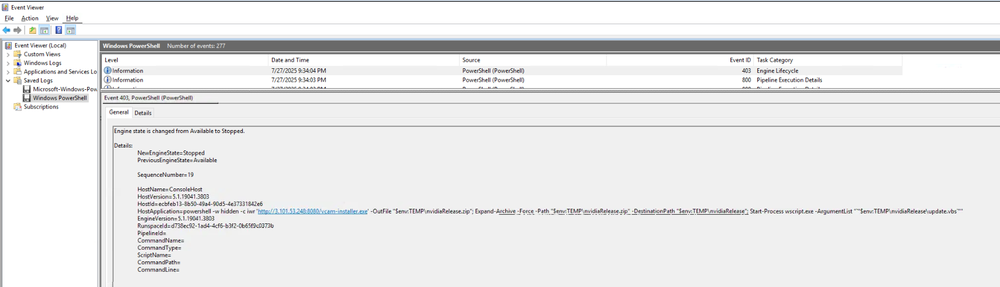
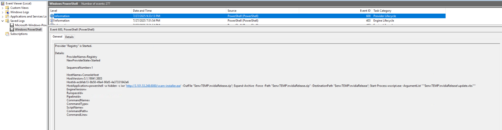
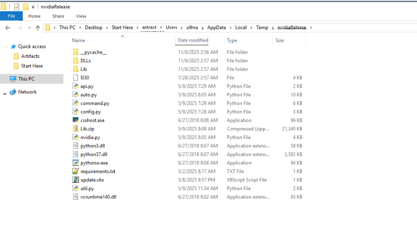
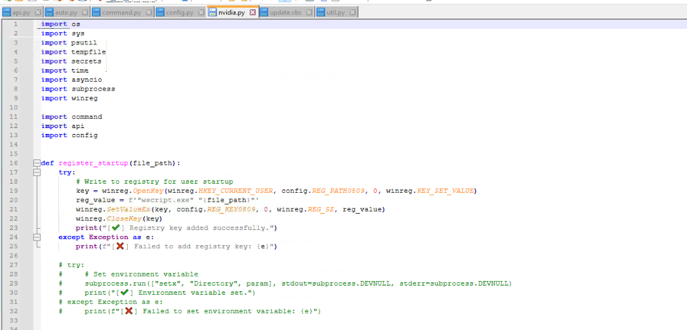
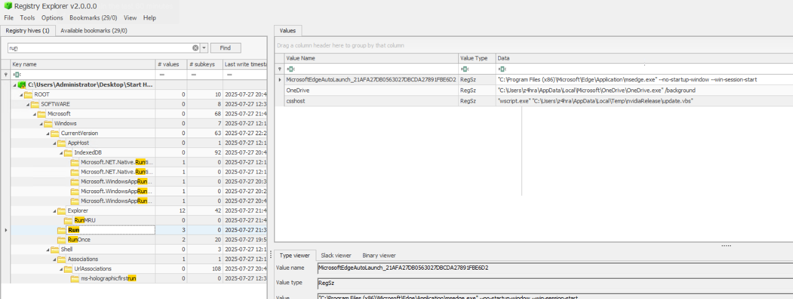
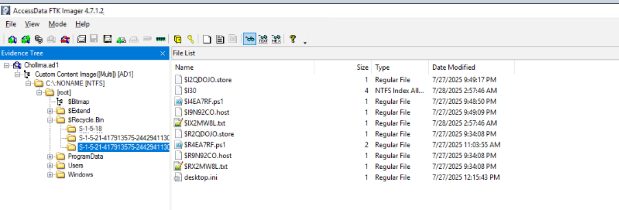
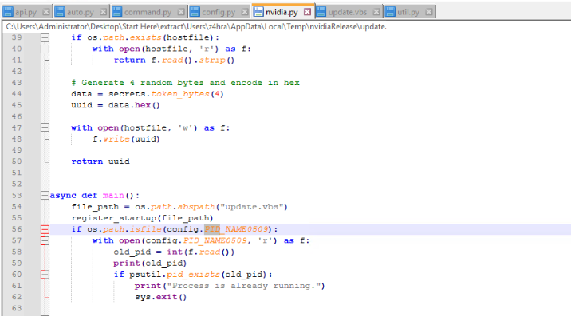
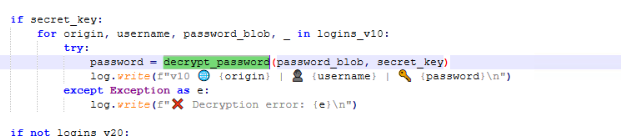
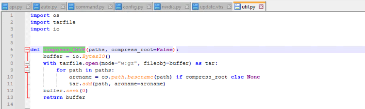

1. Understanding where the malware originated is crucial for identifying the initial attack vector. What is the full URL from which the malicious software was downloaded?
=> Check "Windows Powershell" log in Event Viewer 

2. Pinpointing the exact download time helps establish the beginning of the attack chain. What is the timestamp when the malicious ZIP file was created on the machine?
=> Check "Windows Powershell" log in Event Viewer and search file "vcam-installer.exe" See Outfile 
=> 2025-07-27 21:33

3. Execution is handed off to a script file that runs the main malware. What is the SHA256 hash of this malicious script?
=> See the zip and vbs file were stored at folder \TEMP\nvidiaRelease 
=> 0EC9D355F482A292990055A9074FDABDB75D72630B920A61BDF387F2826F5385 (upload file update.vbs into cyberchef to get SHA256)

4. Recognizing the method of persistence is key to effective eradication. What is the name of the function responsible for creating the persistence mechanism?
=> Open file nvidia.py and see the function register_startup 
=> Open file NtUser.dat by registry explorer and search key RUN  
=> register_startup

5. Establishing a timeline is critical. At what exact time and date did the malware establish persistence?
=> Check "Windows Powershell" log in Event Viewer at 2025-07-27 21:34 
=> Start-Process "update.vbs" were started 

6. Attackers use common techniques to maintain access. What is the MITRE ATT&CK ID for the sub-technique used by the malware to achieve persistence?
=> CurrentVersion\RUN belonged to T1547.001

7. To access protected data, malware often needs to elevate its privileges. What is the name of the function that attempts to re-launch the malware with administrator rights?
=> file auto.py and see function "auto_mode_chrome_cookie"
=> See code if have admin rights , file will create_service() and run_executable()

8. To avoid detection, malware uses randomized sleep timers to blend in with normal network traffic. What is the name of this technique?
=> search time.sleep query in folder \TEMP\nvidiaRelease
=> time.sleep(1) => "jitter" technique

9. Malware often uses unique identifiers for tracking. What is the UID value that was created and stored to identify this specific infected machine?
=> Search UID in folder \TEMP\nvidiaRelease 
=> See function "generate_UUID0509" , UUID were stored at config.MACHINEID_HOST_FILE_NAME0509
=> MACHINEID_HOST_FILE_NAME0509 = ".host"
=> See file with filetype ".host" at Recycle Bin 
=> UUID: fa2a216e

10. To avoid running multiple noisy instances, the malware uses a lock file. What was the Process ID (PID) of the malware recorded in this file?
=> Search keyword "PID" => PID_NAME0509 at function "main" 
=> PID_NAME0509       = ".store"
=> See file with filetype ".store" at Recycle Bin   => PID: 7900

11. To ensure stability and avoid self-destruction, the malware validates file paths during decompression. What is the name of the vulnerability this check protects against?
=> See function "valid_rel_path" and see comment to prevent "Path traversal" to ensure stability and avoid self-destruction

12. Understanding the attacker's goal requires knowing what data they target. What is the name of the popular cryptocurrency wallet associated with the first extension ID in the malware's config?
=> See "EXTENSION_NAMES0509" of file "config.py"
=> Search first extension ID and see result "MetaMask"

13. The password theft process relies on specific functions. What are the two critical functions used to get the master key and decrypt the password blob, respectively?
=> functions used to get the master key
=> See function "get_secret_key" => get master key of file "\AppData\Local\Google\Chrome\User Data"

=> functions used to decrypt the password 
=> function decrypt_password to decrypt the secret key by password blob

14. Malware often stages stolen data in temporary files. What is the full path of the log file created to store stolen browser credentials?
=> At function auto_mode_chrome_cookie see file "chrome_logins_dump.txt" were used to stored browser credentials

15. Identifying key functions helps in understanding the code. Which function is called to package stolen directories for exfiltration?
=> See function "compress_0509" to package the stolen directories for exfiltration 

16. Tracking outbound connections is essential for identifying C2 infrastructure. What is the IP address and port of the C2 server?
=> See UPLOAD_URL0509 = "http://154.58.204.15:8080"  at file config.py
=> IP: 154.58.204.15

17. C2 communication is often encrypted to evade detection. What symmetric stream cipher is used to encrypt the data sent to and from the C2 server?
=> See function "packet_make0509" were encrypt the data before sent to C2C server by RC4

18. Operators use C2 channels to deploy additional tools. Which function would be used to download a second-stage payload onto the victim's machine?

=> See function "process_upload" in file command.py will download a second-stage payload onto the victim's machine

19. C2 servers issue commands using obfuscated codes. What is the opcode used to instruct the malware to steal browser cookies and passwords?
=> See function "main" in file nvidia.py
=> cookie will be onfuscated by "COMMAND_AUTO0509"
=> R4ys

20. Data must be packaged before being sent. Which function is responsible for wrapping outbound data into the custom encrypted packet format?

=> See function "htxp_exchange0509" will encrypt packet and packet were encrypted by function "packet_make0509" in file "api.py"

