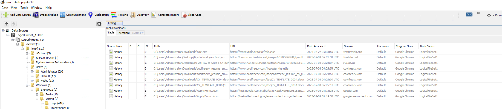
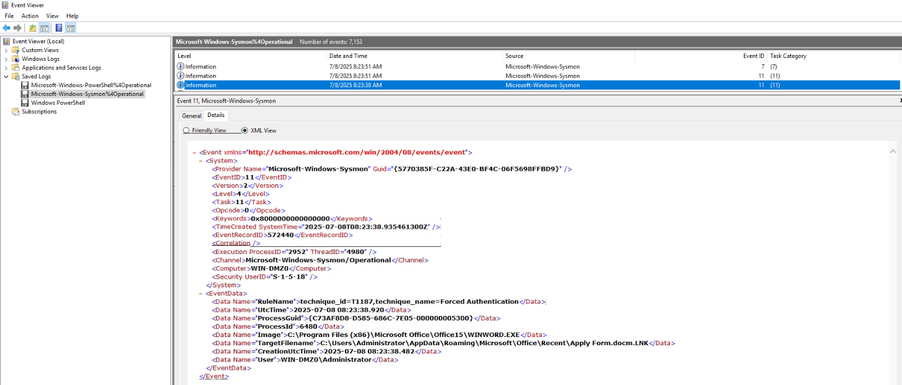
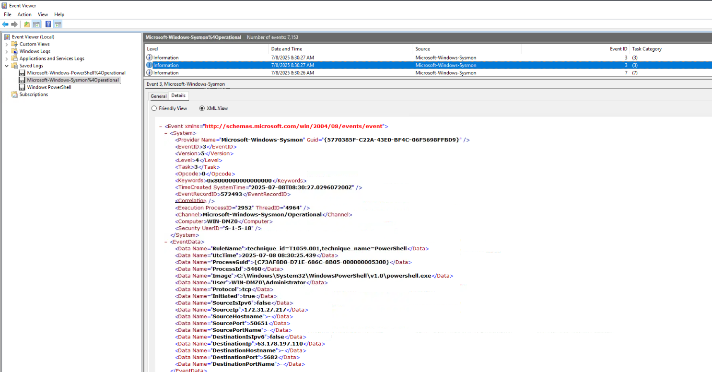
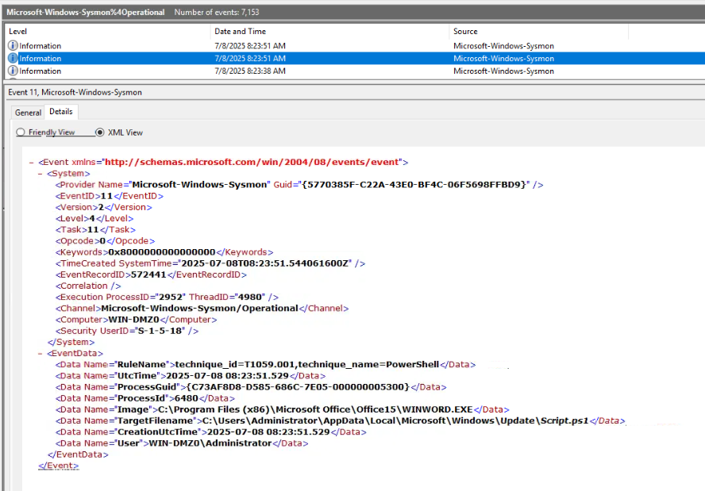

1. During the initial compromise phase, a malicious document was downloaded to the victim's system. What is the timestamp when this download activity began?
=> file "Apply Form.docm" were downloaded at 2025-07-08 08:14  

2. After the malicious document was executed, embedded code created additional files on the system. What is the full directory path where these secondary payloads were stored?
=> At 2025-07-08 08:23:38 user open file "Apply Form.docm" by Word 
=> At 2025-07-08 08:23:51 , new process were created 
=> Folder: C:\Users\Administrator\AppData\Local\Microsoft\Windows\Update\
=> File: Script.ps1

3. What is the creation timestamp for the scripts generated by the malicious document? (in UTC)
=> 2025-07-08 08:23

4. The malware established communication with external infrastructure for command and control purposes. What is the IP address of this C2 server?
=> At 2025-07-08T08:30:27 => powershell.exe were connect to C2C server: 63.178.197.110

5. To maintain access across system reboots, the malware registered a scheduled task. What is the complete command line that this scheduled task executes?
=> "C:\Windows\system32\wscript.EXE" "C:\Users\Administrator\AppData\Local\Microsoft\Windows\Update\Updater.vbs" in log sysmon

6. After the scheduled task executed, another malicious script was initiated. What command was used to launch this subsequent script?
=> "C:\Windows\System32\WindowsPowerShell\v1.0\powershell.exe" -Exec Bypass C:\Users\Administrator\AppData\Local\Microsoft\Windows\Update\Script.ps1

7. The threat actor established a second persistence mechanism through an additional scheduled task. What is the name of this secondary scheduled task?
=> "C:\Windows\system32\schtasks.exe" /run /tn MicrosoftEdgeUpdateTaskMachineUC
=> MicrosoftEdgeUpdateTaskMachineUC

8. The threat actor remotely triggered manual execution of their secondary scheduled task via C2 communications. What is the timestamp when this remote execution command was processed? (in UTC)
=> 2025-07-08 09:28

9. During the reconnaissance phase, the attacker executed a command to gather detailed information about the current user context and privileges. What specific command was used?
=> "C:\Windows\system32\whoami.exe" /all

10. The threat actor performed network reconnaissance to map the infrastructure topology. Which Windows built-in utility was leveraged for this network discovery activity?
=> "C:\Windows\system32\TRACERT.EXE" 8.8.8.8

11. The malware deployed a keylogging component using a renamed legitimate executable. What is the original name of this executable?
=> Executable Info
"C:\Users\Public\module\module.exe" "C:\Users\Public\module\module.ahk" with SHA256: 25BB276AAB41E22DBEB1709225D57FA8237F829E809453CBB0D60B6ABF1B6C79
=> check in VT: AutoKey.exe

12. The keylogger stored captured data in a Windows registry location before exfiltration. What is the name of the registry value entry used for this temporary storage? 
=> Open file "C:\Users\Public\module\module.ahk"
=> Registry value entry : KeypressValue

13. Prior to exfiltration, the keylogger data was extracted from the registry and written to a file for staging. What is the filename of this staging file?
=> In folder: C:\Users\Public\module\
=> See file readKey.ps1 => $logFile = "$env:temp\logFileuyovaqv.bin"

