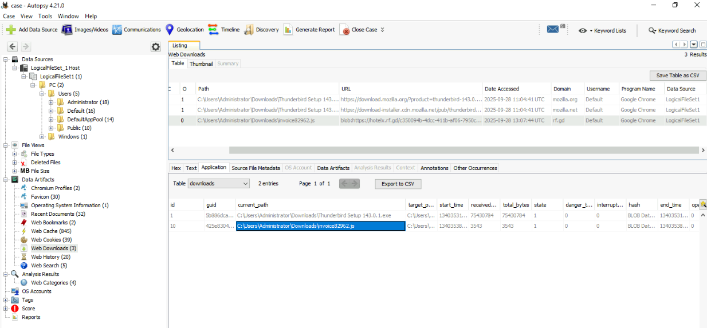
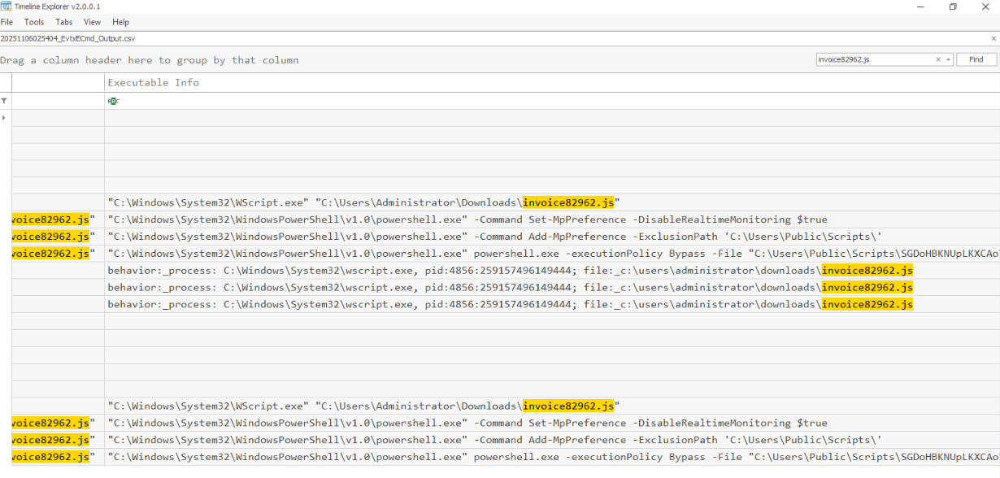
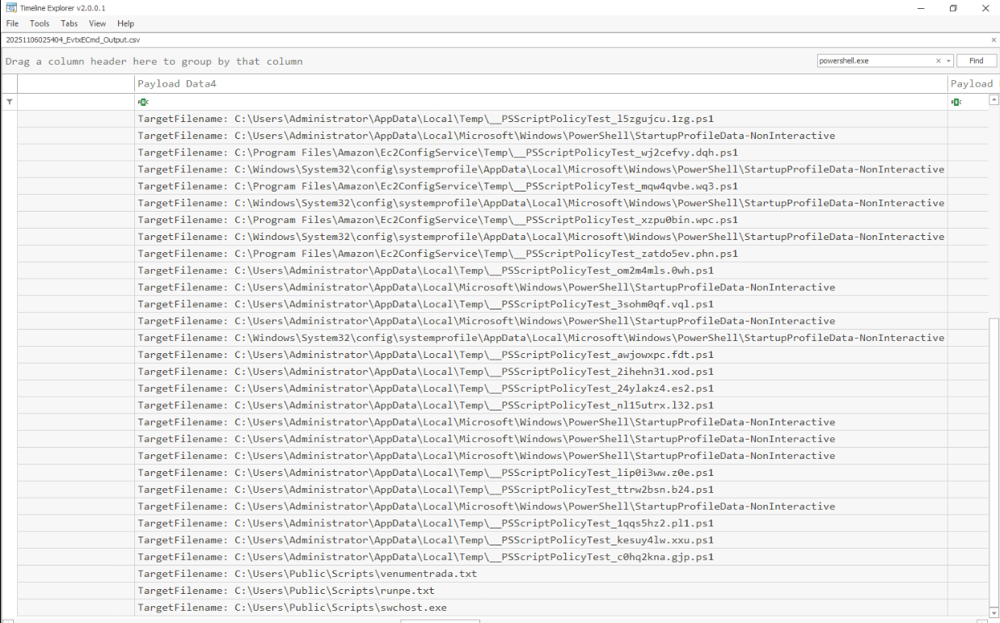
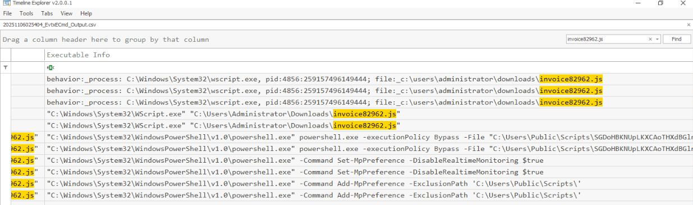

1. During the initial compromise, the threat actor distributed a phishing email containing a URL pointing to a malicious JavaScript file disguised as a legitimate document. What is the name of the JavaScript file downloaded from the phishing link?

2. The malicious JavaScript payload was hosted on a compromised website to facilitate the initial infection. What is the complete domain name that hosted the malicious JS file?

Search in tab Web Downloads (AutoSpy)

3. The JavaScript file created a PowerShell script to advance the attack chain. What is the full directory path where the PowerShell script was created from the JS file?

search file js in log evtxecmd => C:\Users\Public\Scripts

4. The PowerShell script invoked another PowerShell command to download two additional files onto the device and then executed one of them. What are the names of the downloaded files?

search powershell.exe with filecreate and see 2 file exe, txt in C:\Users\Public\Scripts (this folder were added Exclusion Path to avoid scan virus)   => venumentrada.txt, runpe.txt

5. The downloaded files included obfuscated content that needed to be converted to reveal their true nature. What is the actual file type of the second downloaded file?

6. The first downloaded file converted the second file to its original format, saved it, and then executed it. What is the name of the executed file that was run after conversion?

Second file were downloaded is file (runpe.txt).See another file exe in folder C:\Users\Public\Scripts can be the answer of Q6

7. The initial JavaScript file employed specific technique to evade security controls and prevent detection. What is the MITRE ATT&CK technique ID for the method used by the JavaScript file?

See ""C:\Windows\System32\WindowsPowerShell\v1.0\powershell.exe" -Command Add-MpPreference -ExclusionPath 'C:\Users\Public\Scripts\'" -> T1562.001

